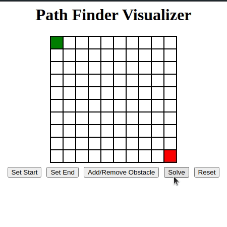

# Path Finder Visualizer
A simple webpage that allows user's to visually see a path finding algorithm. Built in vanilla HTML/CSS/Javascript,
a user can build thier own custom mazes and and see the most optimal path through it using Djikstra's algorithm.

## Demo

## Development Setup

### Prerequisites
- None

### Configuration
1) Clone the repo, `git clone https://github.com/chumnend/path-finder.git`
2) Open the `index.html` file in a web browser. Refresh the page to see any changes.

## Deployment
Not deployed.
